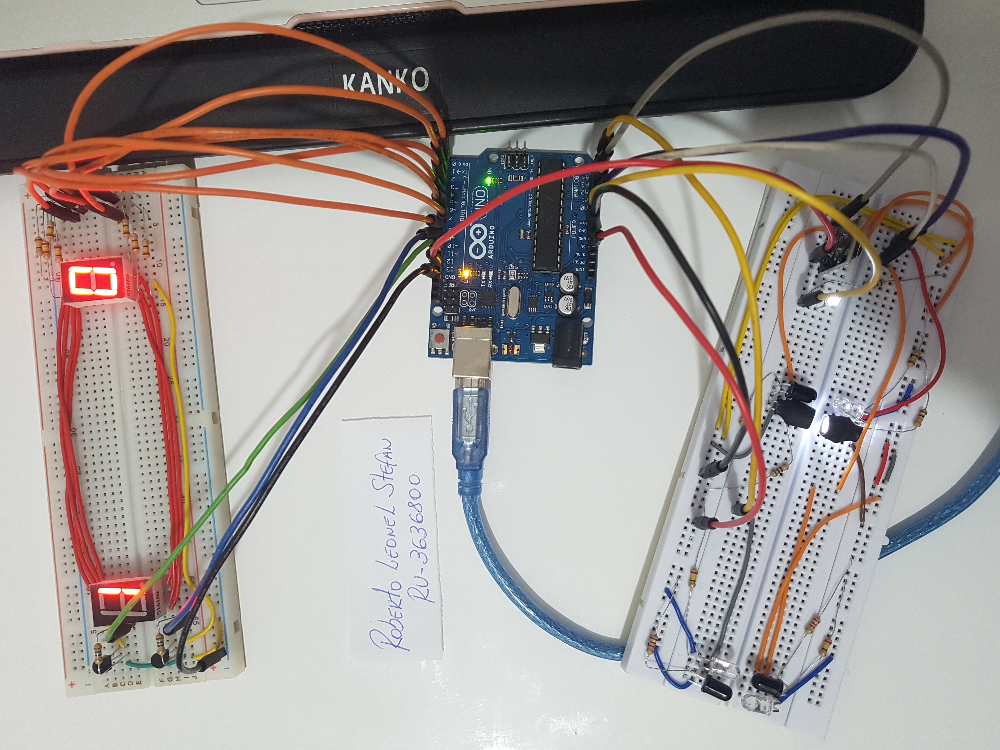
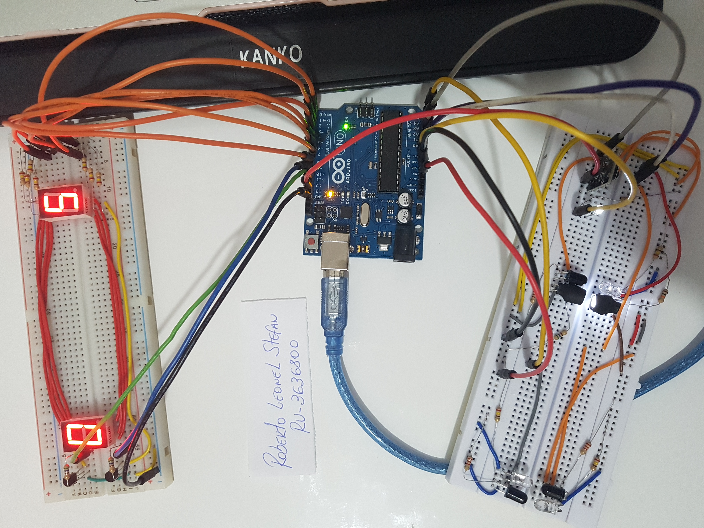
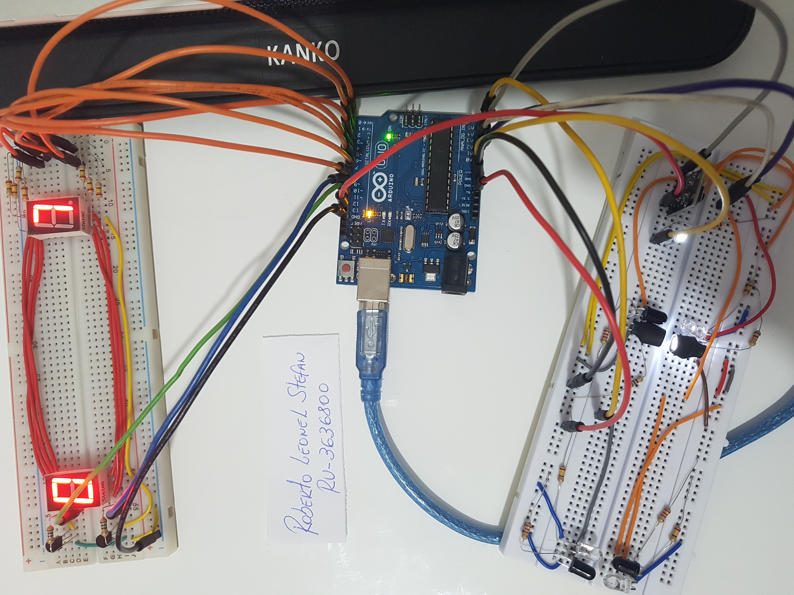
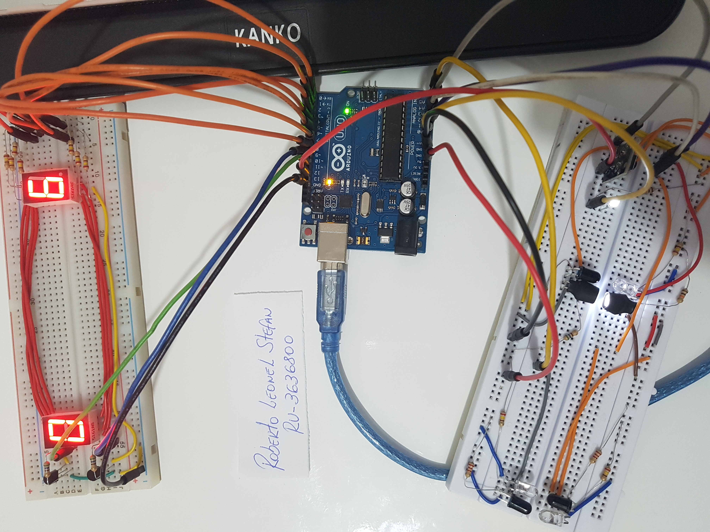
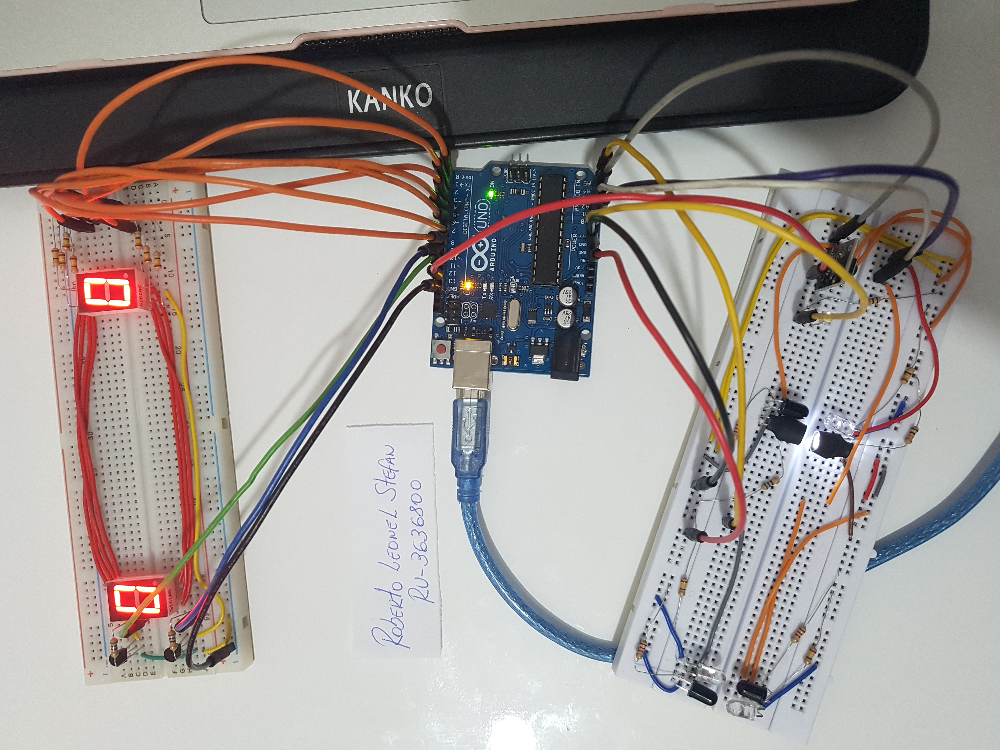
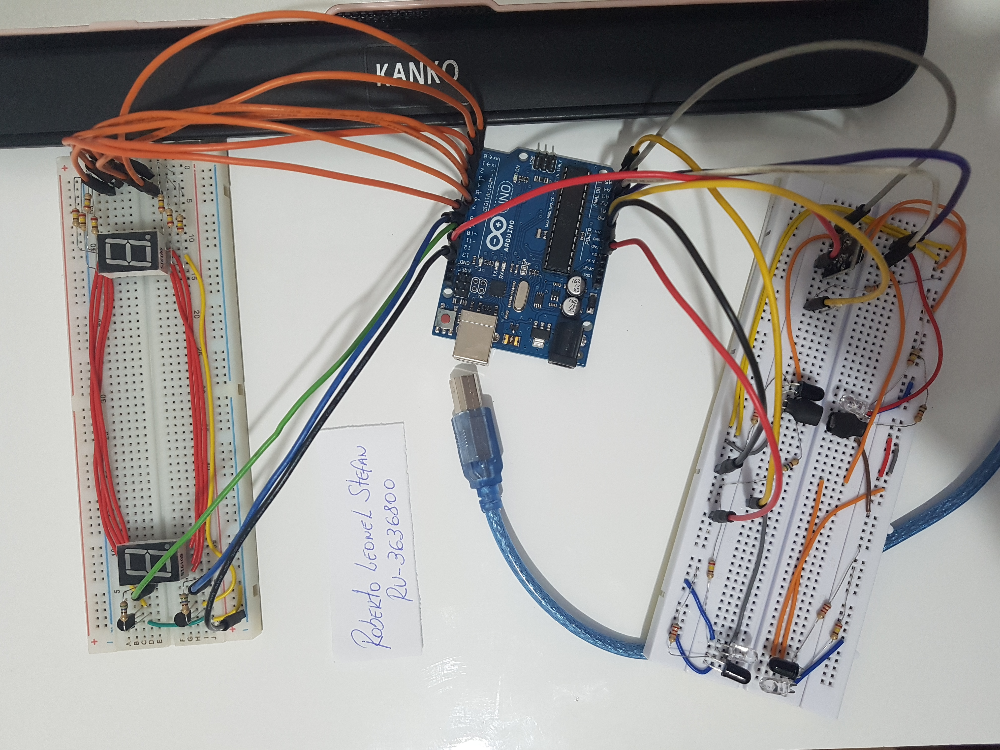
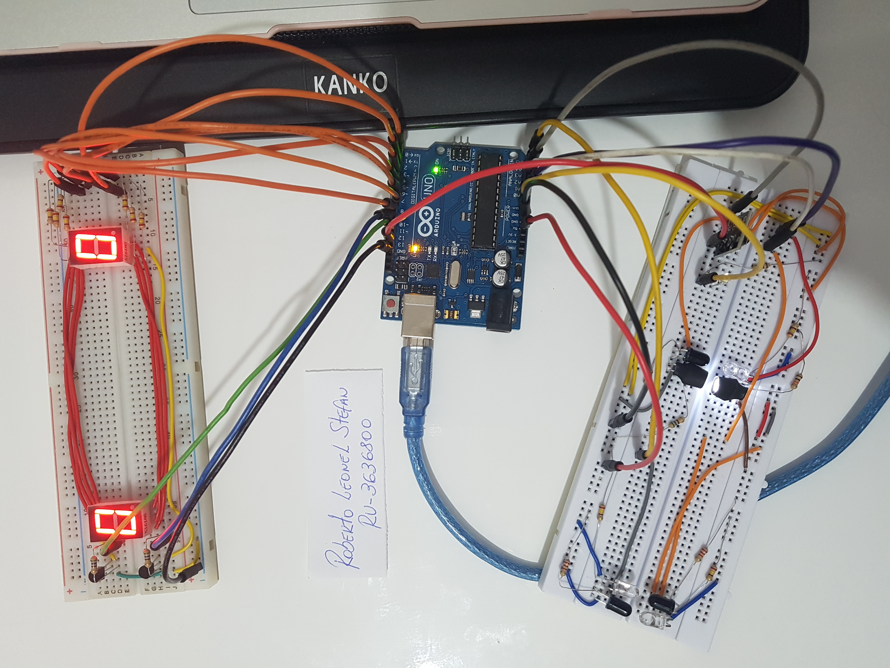
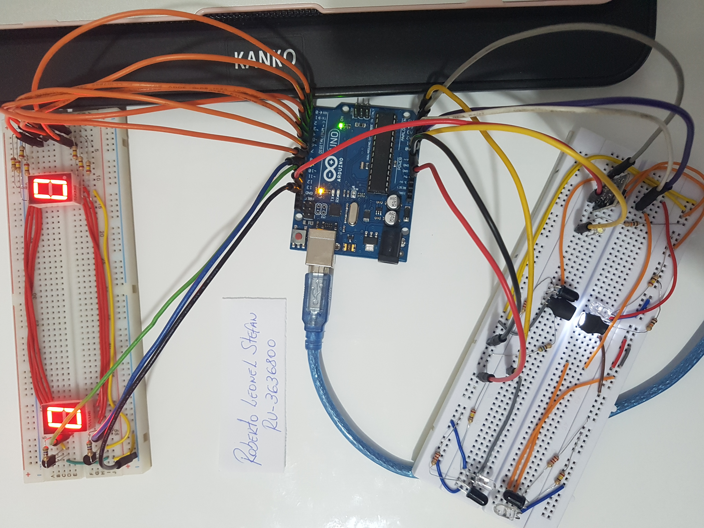

# Bidirectional People Counter – Arduino

Este projeto implementa um **sistema de contagem bidirecional de pessoas** para ambientes fechados com duas entradas, utilizando **sensores infravermelhos** e displays de 7 segmentos multiplexados. O sistema detecta entradas e saídas em tempo real e exibe o número de pessoas presentes.

---

## 🇺🇸 English Version

**Overview:** Bidirectional people counting system for closed environments with front and back entrances. Real-time display using multiplexed 7-segment displays, LED occupancy indicator, and reset button.

**Prototype images:** see `prototype/` folder  
**Demo video:** [YouTube Link](https://www.youtube.com/watch?v=mXwFLK2ADg8)  
**Project presentation:** `project_presentation/Sistema_de_Contagem_Bidirecional_de_Pessoas.pptx`

---

### System Features

* Bidirectional people detection  
* Entry and exit monitoring  
* Real-time counting (0–99)  
* Multiplexed 7-segment display control  
* LED occupancy indicator  
* Manual reset button  
* Direction detection using sensor sequence  

---

### Hardware Components

* Arduino Uno  
* 2 × Seven Segment Displays  
* 3 × Infrared Sensors  
* 1 × LDR (Light Dependent Resistor)  
* 2 × NPN Transistors (BC547) for multiplexing  
* 1 × LED indicator  
* 1 × Reset push button  
* Resistors, protoboard, jumper wires  

---

### Pin Configuration

**Seven Segment Displays**

| Segment | Arduino Pin |
| ------- | ----------- |
| a       | 7           |
| b       | 8           |
| c       | 4           |
| d       | 3           |
| e       | 2           |
| f       | 6           |
| g       | 5           |

**Display Control**

| Display   | Function | Arduino Pin |
| --------- | -------- | ----------- |
| Display 1 | Units    | 9           |
| Display 2 | Tens     | 11          |

**Sensors**

| Door       | Sensor     | Arduino Pin |
| ---------- | ---------- | ----------- |
| Front      | External   | A5          |
| Front      | Internal   | A3          |
| Back       | External   | A4          |
| Back       | Internal (LDR) | A1       |

**LED & Reset Button**

| Component    | Arduino Pin |
| ------------ | ----------- |
| LED          | A0          |
| Reset Button | 13          |

---

### System Operation

**Entry Detection:** External → Internal → Increment counter  
**Exit Detection:** Internal → External → Decrement counter  

*Implemented with a state machine algorithm in firmware.*

**Display Operation:** Shows 0–99 people  
**Occupancy Indicator:** LED OFF → empty, LED ON → at least one person  
**Reset:** Press button → counter resets to zero, LED blinks

---

## 🇧🇷 Versão em Português

**Visão Geral:** Sistema de contagem bidirecional de pessoas para ambientes fechados com portas da frente e dos fundos. Exibição em tempo real em displays de 7 segmentos, LED indicador de ocupação e botão de reset.

**Imagens do protótipo:** ver pasta `prototype/` 
## Prototype Screens

  
  
  

  
  
  

  
  

**Vídeo de demonstração:** [YouTube Link](https://www.youtube.com/watch?v=mXwFLK2ADg8)  
**Apresentação do projeto:** `project_presentation/Sistema_de_Contagem_Bidirecional_de_Pessoas.pptx`

---

### Características do Sistema

* Detecção bidirecional de pessoas  
* Monitoramento de entrada e saída  
* Contagem em tempo real (0–99)  
* Controle de displays de 7 segmentos multiplexados  
* LED indicador de ocupação  
* Botão de reset manual  
* Detecção de direção baseada na sequência de sensores  

---

### Componentes de Hardware

* Arduino Uno  
* 2 × Displays de 7 segmentos  
* 3 × Sensores infravermelhos  
* 1 × LDR  
* 2 × Transistores NPN (BC547) para multiplexação  
* 1 × LED indicador  
* 1 × Botão de reset  
* Resistores, protoboard, jumpers  

---

### Funcionamento do Sistema

**Entrada:** Sensor externo → Sensor interno → Incrementa contador  
**Saída:** Sensor interno → Sensor externo → Decrementa contador  

*Implementado com máquina de estados no firmware.*

**Displays:** Mostram 0–99 pessoas  
**Indicador LED:** LED DESLIGADO → sala vazia, LED LIGADO → pelo menos uma pessoa  
**Reset:** Pressionar botão → contador reinicia, LED pisca

---

### Estrutura do Projeto

people-counter-arduino/
│
├── lib/
├── src/
│ └── Sistema_de_Contagem_Bidirecional_3636800.ino
├── prototype/
│ └── [imagens]
├── project_presentation/
│ └── Sistema_de_Contagem_Bidirecional_de_Pessoas.pptx
└── README.md

---

### Possíveis Aplicações / Possible Applications

* Monitoramento de salas / Smart room monitoring  
* Controle de fluxo de pessoas / Building occupancy control  
* Sistemas de iluminação eficiente / Energy-efficient lighting  
* Monitoramento de acesso / Access monitoring systems  
* Automação predial / Smart building automation
